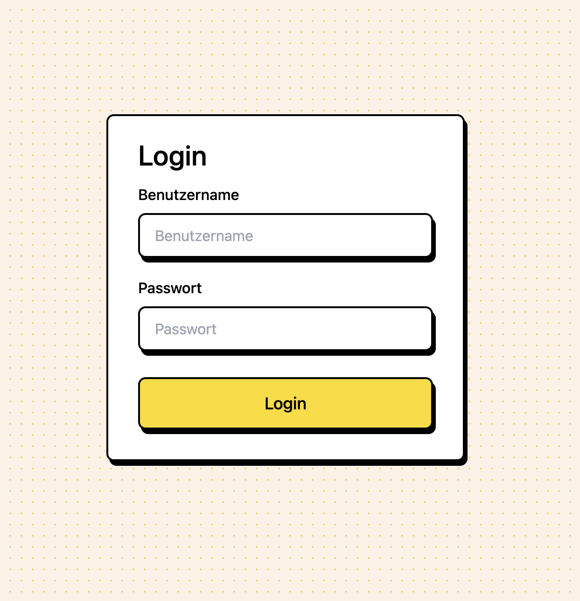
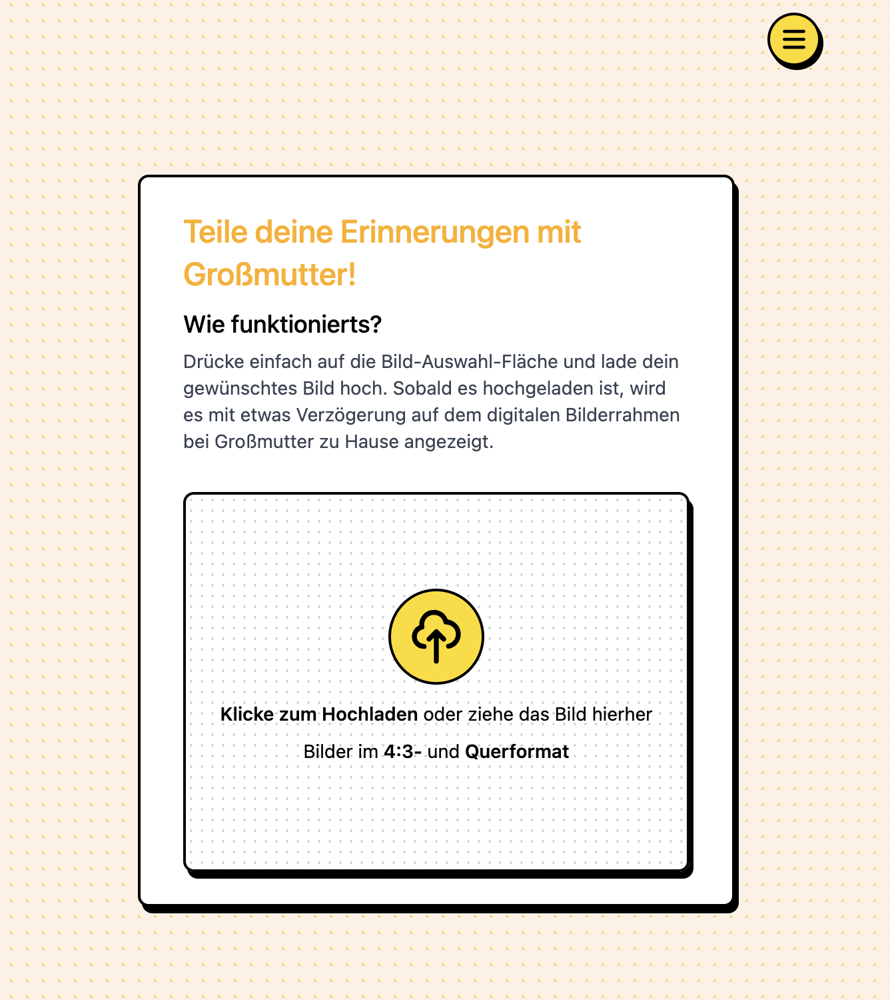
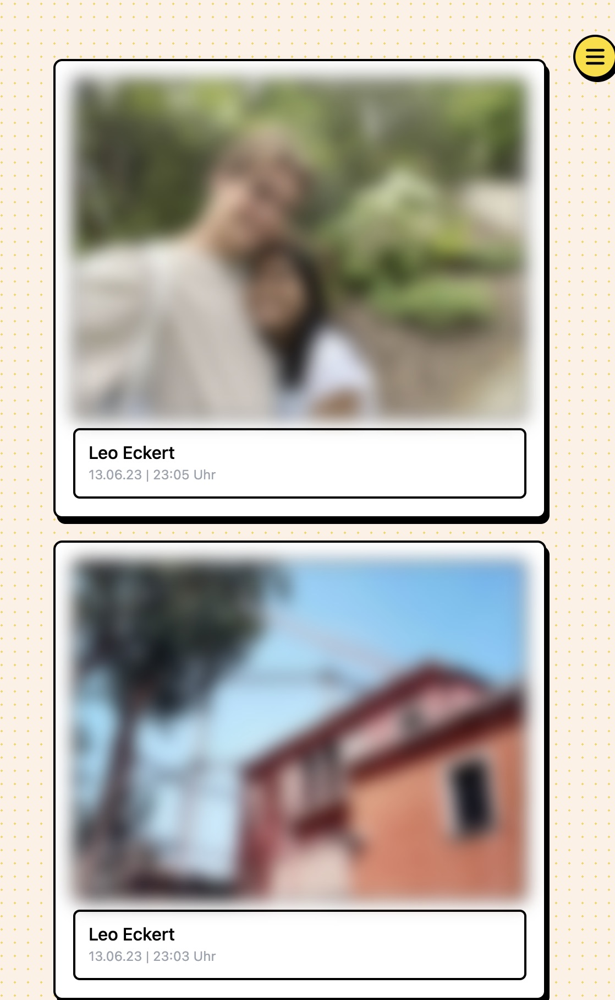

# About this project
This is a small project involving a web app where you can upload an image daily. 
This image will then be pulled from a digital frame and displayed in someone's home ([this](https://shop.pimoroni.com/products/inky-frame-5-7?variant=40048398958675) digital frame to be exact).
Development of this project is currently paused.

# Frontend
I use Seveltekit as a frontend framework and TailwindCSS to do all the styling.

# Backend 
I use Pocketbase as a go framework to handle the conversion and processing of uploaded files.

*Disclaimer*: This is my first project ever with go, and I am still quite new with it.

# Features 
## Login

## File upload 
Users can upload any type of image file (including .heic)

## View uploaded images

Users can view images that have been uploaded by themselves or other users with additional information

